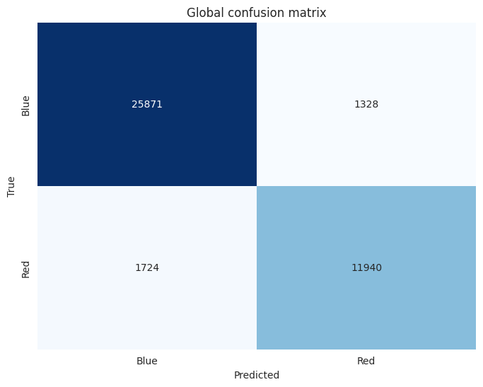
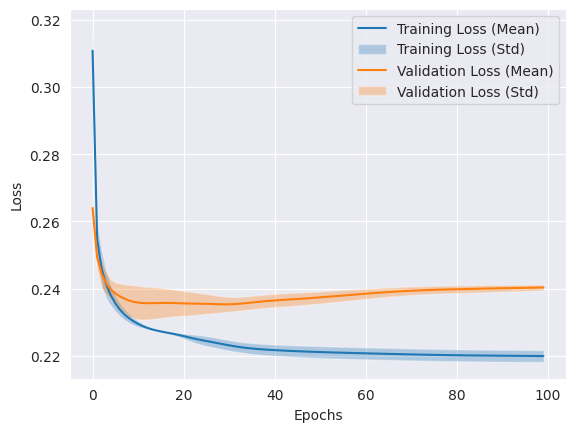
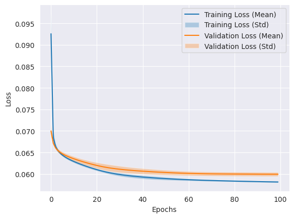
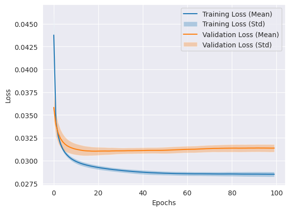
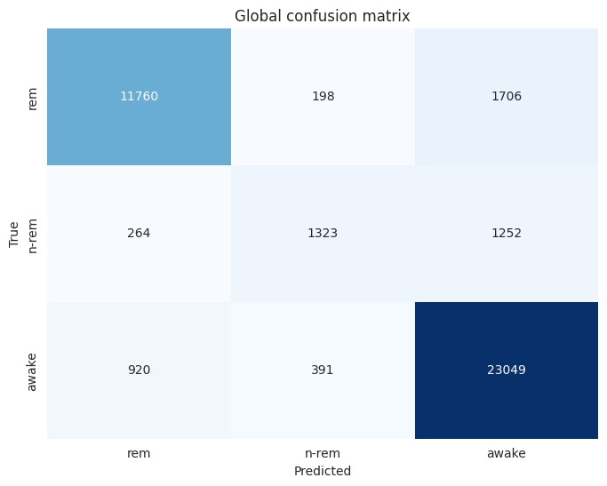

# Labo 3 - ARN
Auteurs: Felix Breval et Samuel Roland

## Introduction
<!-- Note: vraiment utile ?? Dans ce laboratoire, nous allons appliquer et analyser un ensemble de modélisations data-driven sur un jeu de données de classification. -->
Le but de ce laboratoire est de pouvoir classifier l'état de sommeil d'une souris à partir de données d'électroencéphalogramme grâce à un MLP, un réseau de neurones de perceptrons multi-couches.

Nous avons à disposition deux jeux de données avec l'état de sommeil sur lesquels s'entrainer et valider les résultats: `EEG_mouse_data_1.csv` et `EEG_mouse_data_2.csv` ainsi qu'un jeu de données sans l'état de sommeil pour la compétition: `EEG_mouse_data_test.csv`. Sur ce dernier nous ne ferons que de lancer des prédictions sur notre meilleur modèle sans pouvoir à quelles points elles sont bonnes.

Dans nos dataframe extraits à partir des fichiers CSV précedemment cités, nous avons 1 colone `state` qui est l'état connu de sommeil (w = réveillé, et 2 états endormis n = nrem, r = rem) et 101 colonnes `amplitude_around_1_Hertz`, `amplitude_around_2_Hertz`, ... indiquant des amplitudes de fréquence mesurées. On observe déjà que ces amplitudes sont très faibles, ex. `0.000009` et nous avons pris uniquement les 25 premières colonnes car les valeurs deviennent encore beaucoup plus petites par la suite par ex `5.130010e-09`.

<!-- //TODO parler plus des données et ce qu'on utilise: je crois c'est assez mtn ? -->

Nos données d'entrainement seront utilisées pour entrainer nos modèles ainsi que faire de la validation croisée.
De plus, nous allons faire une matrice de confusion pour chaque modèle ainsi que leur F-score respectif.

## Partie 1

Dans cette première partie, le seul but est de pouvoir reconnaître l'état d'une souris dormant ou éveillée.

### Choix du modèle

En ce qui concerne le modèle, nous avons utilisé la fonction d'activation **tanh** sur la couche couchée et le perceptron de sortie.
Pour cela, les données ont été normalisées avec -1 pour les valeurs "dorment" (rem/non-rem) et 1 pour les valeurs "éveillées"(awake).

Pour le nombre de neurones nous avons essayé différentes configurations avec une seule couche cachée.
Le nombre de neurones essayés ont été, 2, 4, 8, 20, 30. Nous avons remarqué une augmentation d'overfitting à partir de plus de **8 neurones** et avons décidé de s'arrêter à 8.

Concernant le nombre d'épochs, la plupart des tests ont été faits avec 20 epochs afin de pouvoir supposer sur la direction que prenait le modèle.
Nous avons cependant remarqué qu'un nombre d'epochs plus grand continuait à apporter des meilleurs résultats mais à un rythme logarithmique.
C'est pour cela que nous avons décidé de nous arrêter à **100 epochs**.

La loss function utilisée est **MSE**, l'optimizer est **SGD**. Les paramètres pour l'optimizer sont les suivants:

- learning rate: 0.001
- momentum: 0.99

Nous avons essayé avec d'autres paramètres mais ceux-ci ont donné les meilleurs résultats.

### Résultats

Nous avons obtenu un f1 score moyen de **0.88663** et la matrice de confusion suivante:



On peut remarquer qu'il y a encore de l'overfitting mais le modèle est capable de bien classifier les données de tests.

Voici le plot de la loss function:



<!-- est-ce quon voudrait pas inverse les 2 parties avec images comme dans le rapport ?  en tous cas j'ai inversé dans les 2 parties suivantes -->

## Partie 2

Cette fois, on cherche à classifier les 3 états original, donc de pouvoir différencier les 2 états de sommeil également. Nous avons maintenant 3 perceptrons de sortie utilisant non plus `tanh` mais `softmax` comme fonction d'activation. Nous avons gardé 8 neurones dans une seule couche cachée utilisant `tanh`. 
<!-- todo: est-ce qu'on doit dire pourquoi softmax ? je sais pas la raison là... -->
Nous avons également gardé la même loss function utilisée **MSE**, l'optimizer est **SGD** toujours avec les mêmes paramètres de learning rate: 0.001 et momentum: 0.99.

Nous avons gardé 100 epochs une fois la meilleure combinaison trouvée.

Il y a très peu d'overfitting comme les 2 courbes sont très proches l'une de l'autre ce qui est plutôt bon signe.


Notre matrice de confusion montre déjà que l'état `rem` et `awake` sont très bien classifiés, le ratio de faux négatif et faux positif est relativement petit (~1/20). Par contre, il y a une grosse confusion pour ce modèle pour classifier les `nrem`, qui sont plus souvent mal classifiés en `awake` (1323) plutôt qu'en `nrem` (1194). Cela s'explique aussi parce qu'il y a beaucoup moins de données dans cet état, le modèle a pas eu assez l'occasion de vraiment apprendre à détecter cet état correctement.


Le f1 score moyen obtenu est de **0.77723**.

## Partie 3 - Compétition
Nous somme partie du notebook de la partie 2 et commencé à tester plein de variantes et combinaisons différentes pour faire augmenter ultimement la valeur du f1 score tout en gardant l'overfitting au minimum.

Nous avons fait plein de petits essais sur 10-20 epochs mentionnés ci-dessous.

Nous avons d'abord essayé de passer en `leaky_relu`, de passer `CategoricalFocalCrossentropy` par rapport à la recommendation d'un autre groupe, puis d'augmenter le nombre de couches cachées, par ex. 3 couches de 8 perceptrons, 3 couches de 16, 6 couches de 4, ... mais nos tournions autour de 0.73-0.74 donc un moins bon sur le partie 2.

Avec la configuration suivante (ADAM et teste sur 12 perceptrons en `relu`), nous avons pu remonté aux performances de la partie 2.
```
optimizer='adam',
loss=keras.losses.CategoricalFocalCrossentropy(alpha=0.05),
layers.Dense(12, activation="relu"),
epochs=20
Mean F1 Score across all folds: 0.7776879074531463
```

En testant `nadam` au lieu de `adam`, c'est un peu moins bien: `Mean F1 Score across all folds: 0.7805643774178725`
En tentant d'augmenter à 30 neurones dans une couche cachée toujours en `leaky_relu`, on obtient pas vraiment mieux: `Mean F1 Score across all folds: 0.7824860701953334`

Finalement, là où nous avons eu le meilleur f1 score est `rmsprop`, avec comme loss function `CategoricalFocalCrossentropy` avec paramètres par défaut, 20 perceptrons dans une seule couche cachée utilisant `leaky_relu`. 3 perceptrons de sortie utilisant `softmax`.


<!-- TODO: Is there overfitting? -->

<!-- TODO: compléter pour répondre à How did you choose the
learning rate? How did you choose the number of neurons and number of layers?  -->

<!-- TODO:Should we train for longer? -->

En terme de confusion, c'est pas très différent de la partie 2, c'est toujours très confus pour la classe `nrem` même s'il y a légèrement plus de vrai positif. Le modèle choisit un peu moins souvent `rem`. Les classes `rem` et `awake` restent de manière générale bien reconnues.


Le f1 score moyen obtenu est de **0.78550**.

Comme demandé nous avons pu lancer notre meilleur modèle parmi les 3 folds sur les données de test et exporté en fichier `test_pred.npy`.